 

## 👋 About Me

I'm a software engineer from Egypt 🇪🇬 who likes building things that hold up when they leave the demo. Lately that means **reliable AI agent backends**, **satellite and computer-vision pipelines**, and **bilingual (Arabic/English) web and mobile apps** that real businesses use.

My graduation project, **EyeLink**, was an AI accessibility app for visually impaired people, and it earned an **A+**. Since then I've worked across the stack, from Postgres checkpointing and Docker deployments to Flutter apps and React frontends.

  

 

<table>
<tr>
<td valign="top" width="50%">

**🔭 Currently**
- 🤖 Building fault-tolerant AI agent infrastructure
- 🛰️ Exploring geospatial ML (STAC, COGs, YOLOv8)
- ⚙️ Tinkering with VMs and low-level systems in Rust & C

</td>
<td valign="top" width="50%">

**⚡ Quick facts**
- 🎓 B.Sc. Computer Science, Al-Obour High Institute (2025)
- 💼 DEPI Full-Stack .NET Internship, Ministry of Communications
- 🗣️ Arabic (native) · English (B2)

</td>
</tr>
</table>

## 🚀 Featured Projects

<table>
<tr>
<td width="50%" valign="top">

### 🛡️ [Resilient Agent Runner](https://github.com/zeiado/resilient-agent-runner)
Runs multi-step AI agent tasks and keeps them correct when things break. Every step is checkpointed in Postgres, so runs survive worker crashes, retry tools safely, wait for human approval before side effects, and never send the same email twice.

</td>
<td width="50%" valign="top">

### 🛰️ [SatAnalysis](https://github.com/zeiado/SatAnalysis)
Draw an area on a map and get building footprints, density, and land-use stats from Microsoft's Global Building Footprints. Includes a free geospatial similarity search that streams multi-spectral satellite imagery and finds matching terrain.

</td>
</tr>
<tr>
<td width="50%" valign="top">

### 💊 [DDI Prediction](https://github.com/zeiado/DDI-Prediction)
A mobile app that predicts drug-drug interactions with a deep learning model trained on molecular fingerprints, so patients and clinicians can check medication combinations before they cause harm.

</td>
<td width="50%" valign="top">

### 🚗 [AutoFlow](https://github.com/zeiado/AutoFlow)
A bilingual (English/Arabic, RTL-aware) management system for car repair shops: smart booking with conflict-free time slots, a real-time service queue, live notifications, and admin/mechanic dashboards secured with row-level security.

</td>
</tr>
<tr>
<td width="50%" valign="top">

### 🌍 [GeoVision AI](https://github.com/zeiado/-GeoVisoin-AI)
Upload satellite, drone, or aerial imagery, annotate it, fine-tune a YOLOv8 detector, run inference across large images, and view the detections on an interactive map.

</td>
<td width="50%" valign="top">

### 🍽️ [Weqaya](https://github.com/zeiado/Weqayaa) · [Live ↗](https://weqayaa.vercel.app)
An AI nutrition companion for university students, with personalized meal recommendations, dietary advice, and progress tracking for healthier campus dining.

</td>
</tr>
</table>

<b>🧰 More things I've built</b>

 

| Project | What it does |
|:---|:---|
| 🦯 **EyeLink** *(graduation project, A+)* | AI accessibility app for the visually impaired: real-time object detection (YOLOv8) plus live video calls with volunteers (Flutter, Firebase, Agora RTC) |
| 🏢 **[Cvision](https://github.com/zeiado/Cvision)** | Finds a reference building inside a city or aerial photo using vision-language models |
| 🌾 **[Irrigation Circle Detector](https://github.com/zeiado/Nav-Project)** | Classical OpenCV pipeline that detects center-pivot farms in satellite images |
| ♟️ **[Chess Engine](https://github.com/zeiado/Chess_engine)** | Vanilla JS engine with minimax and alpha-beta pruning, rated around 1900 ELO |
| 💍 **[Uno Jewellery](https://github.com/zeiado/unoFront)** · [Live ↗](https://uno-front-eosin.vercel.app) | Bilingual storefront prototype for an Egyptian gold jewellery brand |
| 💪 **[Fitness App](https://github.com/zeiado/Fitness-App)** | Role-based fitness platform with Stripe payments (.NET 8, ASP.NET Core, EF Core) |

## 🛠️ Tech Stack

**Languages** 

**Frontend & Mobile** 

**Backend & Data** 

**AI / ML** 

**DevOps & Tools** 

## 📊 GitHub Stats

  
  

  

## 🏆 Experience & Achievements

| | Role / Award | Organization |
|:--:|:---|:---|
| 💼 | **Full-Stack .NET Intern**: built ASP.NET Core apps with clean architecture and Agile practices | DEPI, Ministry of Communications |
| 🥇 | **Graduation Project, Grade A+**: EyeLink AI accessibility app | Al-Obour High Institute |
| 🔬 | **AI Trainee**: machine learning, computer vision, and Python for AI | Zewail City of Science & Technology |
| 👨‍🏫 | **Mentor**: coached students in competitive programming and algorithms | ICPC Obour Community |
| 🧒 | **Programming Instructor**: taught Scratch, HTML/CSS, and Python to kids | Children's Coding Program |
| 🏅 | **Competitive Programming Level 2** | Coach Academy |
| 📜 | **Modern JavaScript (ES6+)** · **PHP & MySQL Web Apps** | Mahara-Tech / ITI |

### 💬 Let's build something together

I'm open to collaborations, freelance work, and full-time roles in **AI engineering**, **backend**, or **full-stack** development.

 

> *"Accessible technology is not a feature, it's a right."*

